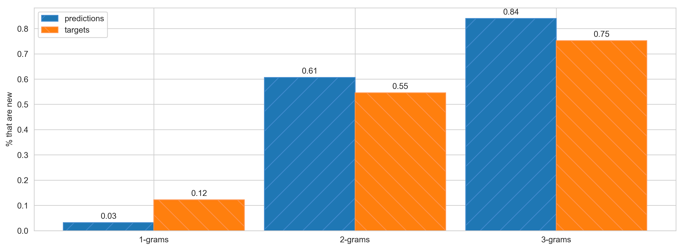

# text-summarizer
In this repo we implemented a pointer generator network (see figure below) from the paper _[Get To The Point: Summarization with Pointer-Generator Networks](https://arxiv.org/abs/1704.04368)_.


We provide here some of the main obtained results and not in a Jupyter Notebook since the most meaningful results are shown in here and running a model inside of a notebook, is impossible due to its size and the size of the dataset.

## Installation
In order to install the needed packages run:
```
pip install -r requirements.txt
```
However in order to be able to compute the ROUGE score you will need to install it (instructions can be found [here](https://github.com/bheinzerling/pyrouge)).

## Data 
To get the data, download the `CNN_STORIES_TOKENIZED` and `DM_STORIES_TOKENIZED` from [here](https://github.com/JafferWilson/Process-Data-of-CNN-DailyMail). Then prepare the data by running `preprocess_data.py`.

The `vocab` file used can be downloaded [here](https://drive.google.com/file/d/0BzQ6rtO2VN95a0c3TlZCWkl3aU0/view).

## Models
The pointer generator can be found in the file `model.py`. However, note that the model is composed of an encoder and decoder that are then used inside the object `PointerGenerator`.

## Results
### Example
* <sub>__Original text:__  by michael zennie for mailonline the nephew of a philadelphia mother of two who was strangled to death last week has been arrested after police say he was caught trying to burglarize her home after her funeral . steven anderson 32 knew no one would home to stop him when he and brandon howard 27 tried to pry open to back door of her house wednesday morning police say . anderson s aunt connie murray 46 was found strangled to death in a park after going for a jog on august 4 . her husband christopher murray 48 has confessed to her murder and is behind bars . the couple s two young daughters are being looked after by relatives . scroll down for video busted steven anderson left the nephew of murdered mother of two connie murray was busted along with his pal brandon howard right connie murray 46 was found strangled to death on august 4 . her husband christopher left has confessed to her murder and is behind bars mourners laid connie murray to rest on monday . wtxf tv reports that a vigilant neighbor spotted the two men trying to break into her house about 2am wednesday and called police . authorities say anderson tried to tell cops that he was just checking on the house with a friend . however both men are career burglars and have lengthy arrest records . anderson had pleaded guilty to burglary just one month ago and received probation . howard had been released from jail just one day before his arrest . one defendant knew that nobody was home and knew the circumstances philadelphia police lieutenant dennis rosenbaun told wtxf . neighbors who are still dealing with the shock of mrs murray s death and her husband s arrest </sub> 
* <sub>__Targeted text:__ steven anderson , 32 , and accomplice brandon howard , 27 , were spotted trying to pry open the back door at 2am wednesday . anderson ' s aunt connie murray was strangled to death on august 4 and her husband christopher has confessed to her murder . anderson and howard are both career burglars , police say . </sub> 
* <sub>__Predicted text:__ steven anderson , 32 , was brandon brandon howard , 27 , found found strangled to pry her to house door of her . morning her had s aunt connie murray , found to death in august 4 . is husband christopher murray confessed to her murder . anderson had her had being career burglars and burglars say </sub> 


### ROUGE
```
ROUGE-1 average_r: 0.48061
ROUGE-2 average_r: 0.20196
ROUGE-L average_r: 0.39728
```
<sub> Note that the data we used to evaluate the model hasn't been prepared like in the paper so the results cannot be compared. </sub>

### Abstractiveness

